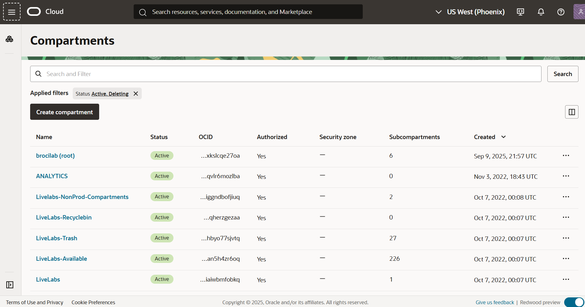

# Explorar un compartimento en OCI

Esta sección contiene 3 partes:
- [Aprendamos un poco sobre la arquitectura de OCI ](#aprendamos-un-poco-sobre-la-arquitectura-de-oci)
- [Comparments](#trabajar-con-compatimentos-compartments-para-organizar-nuestros-recursos-en-oci)
- [Laboratorio 1](#laboratorio-1-exploremos-un-compartment)

## Aprendamos un poco sobre la arquitectura de OCI 

La arquitectura de OCI está compuesta de 3 partes: Regiones, Dominios de Disponibilidad o Availability Domains (AD) y Fault Domain o Dominio de Fallo (FD). Esta arquitectura está diseñada para lograr un alta disponibilidad y confiabilidad de las cargas de trabajo críticas de los clientes. 

Veamos un poco más en que consiste cada una 🤓⤵️

### Regiones
Oracle Cloud Infrastructure se encuentra alojado en regiones y dominios de disponibilidad. Una región es un área geográfica específica. Cada región está compuesta por uno o más dominios de disponibilidad. La mayoría de los recursos de Oracle Cloud Infrastructure son específicos de la región, como una red de nube virtual (VCN), o específicos del dominio de disponibilidad, como una instancia de cómputo.

Las regiones son completamente independientes de otras regiones y pueden estar separadas por grandes distancias, incluso entre países o continentes. Por lo general, desplegaría una aplicación en la región donde se utiliza más, ya que utilizar recursos cercanos es más rápido que utilizar recursos distantes. Sin embargo, también puede desplegar aplicaciones en diferentes regiones para:

- Mitigar el riesgo de eventos en toda la región, como grandes sistemas climáticos o terremotos.
- Cumplir con diversos requisitos legales, fiscales y otros criterios comerciales o sociales en distintas jurisdicciones.

### Dominios de Disponibilidad o Availability Domains (AD)

En una región, puede haber hasta tres dominios de disponibilidad (ADs).

Los dominios de disponibilidad en la misma región están interconectados mediante una red de baja latencia y alta capacidad, lo que permite proporcionar conectividad de alta disponibilidad a Internet y a las instalaciones del cliente, así como construir sistemas replicados en varios dominios de disponibilidad para lograr alta disponibilidad y recuperación ante desastres.

Los dominios de disponibilidad están aislados entre sí, son tolerantes a fallos y es muy poco probable que fallen simultáneamente. Dado que los dominios de disponibilidad no comparten infraestructura, como energía o refrigeración, ni la red interna de dominio de disponibilidad, una falla en un dominio de disponibilidad en una región probablemente no afectará la disponibilidad de otros en la misma región.

### Fault Domain o Dominio de Fallo (FD)

Un dominio de fallos es una agrupación de hardware e infraestructura en un dominio de disponibilidad. Cada AD está compuesto de 3 FDs. Los dominios de fallo le permiten distribuir las instancias de modo que no se encuentren en el mismo hardware físico dentro de un único dominio de disponibilidad. Como resultado, un fallo de hardware o mantenimiento de hardware que afecta un dominio de fallos no afecta a las instancias de otros dominios de fallos.

## Trabajar con compatimentos (compartments) para organizar nuestros recursos en OCI  

Cuando comiences a trabajar con Oracle Cloud Infrastructure, deberá considerar cómo deseas utilizar los compartimentos para organizar y aislar sus recursos en la nube. Los compartimentos son fundamentales en este proceso. Una vez que hayas colocado un recurso en un compartimento, podrás moverlo entre compartimentos.

Al crear un nuevo compartimento, deberás proporcionarle un nombre (con un máximo de 100 caracteres, incluyendo letras, números, puntos, guiones y guiones bajos) que sea único dentro de su jerarquía de compartimentos. También deberás proporcionar una descripción, que es no única y puede cambiar, con una longitud de entre 1 y 400 caracteres. Oracle también asignará al compartimento un ID exclusivo conocido como Oracle Cloud ID (OCID).

Una vez que se haya creado un recurso en un compartimento, podrás moverlo a otro.

La consola está diseñada para mostrar sus recursos por compartimento en la región actual. Al trabajar con sus recursos en la consola, deberás elegir en qué compartimento desea trabajar desde una lista en la página.

Esta lista se filtra para mostrar solo los compartimentos en la ubicación a la que tiene permiso de acceso. Si eres un administrador, tendrás permiso para ver todos los compartimentos y trabajar con los recursos de cualquier compartimento, pero si eres un usuario con acceso limitado, es posible que no lo tengas.

Los compartimentos son globales en todas las regiones; cuando creas un compartimento, está disponible en todas las regiones a las que está suscrito en su contrato.

## Laboratorio 1: Exploremos un compartment

En este laboratorio, explorarás la característica Compartimento dentro de Oracle Cloud Infrastructure.

_**Tiempo estimado para el laboratorio**_: 10 minutos

Objetivos:
- Acceder a la Consola de Oracle Cloud
- Familiarizarse con la interfaz de OCI
- Explorar el Compartimento

1. Accedamos a nuestra consola de OCI
   
   
   
2. En el menu 🍔, seleccionamos Identity & Security ➡️ Compartments

  

  Podemos visualizar los compartments disponibles que tenemos

  

3. Ahora volvemos al menu 🍔, seleccionamos Compute ➡️ Instances
   
  

4. Verificamos que estemos en el compartment correspondiente a nuestro usuario asignado

  

**Super! Continuemos con el siguiente laboratorio 🤩👉 [Laboratorio 2 - VCN](https://github.com/kapvar9/oci-FastTrack-infraestructura/blob/main/Lab2-VCN/Readme.md)**
