# Explorar una VCN en OCI

Esta sección contiene 2 partes:
- [VNC](#aprendamos-un-poco-sobre-lo-que-es-una-vcn)
- [Laboratorio 2](#laboratorio-2-Virtual-Cloud-Network-VCN)
  
## Aprendamos un poco sobre lo que es una VCN

Una Red de Nube Virtual o Virtual Cloud Network (VCN) es una red definida por software que configuras en los centros de datos de Oracle Cloud Infrastructure en una región específica. Se parece mucho a una red tradicional, con reglas de firewall y tipos específicos de gateways de comunicación cuya utilización puede elegir. Una VCN reside en una única región de Oracle Cloud Infrastructure y abarca uno o más bloques de CIDR (IPv4 y IPv6, si están activados). Una subred es una subdivisión de una VCN, pueden ser de tipo público o privada.

Para saber más, puedes consultar la documentación de OCI 🤓➡️ https://docs.oracle.com/es-ww/iaas/Content/Network/Concepts/overview.htm#network_landing

## Laboratorio 2: Virtual Cloud Network VCN

Dependiendo del ambiente que estés utilizando, ya sea un [Sandbox LiveLab](PrimerosPasos/Readme.md) o tu [propio ambiente en Oracle Cloud](PrimerosPasos-OwnEnviroment/README.md), tendrás diferentes recursos iniciales disponibles. En el caso de LiveLab, los compartments y las VCN (Virtual Cloud Networks) ya estarán creados para que puedas explorarlos y familiarizarte con ellos. En cambio, si trabajas con tu cuenta propia, deberás seguir los pasos de creación de compartments y VCN desde cero, lo cual te dará la oportunidad de practicar y entender mejor cómo se configuran estos elementos básicos en la nube.
### Creando una VCN ( Red Virtual en la nube)

Objetivos
- Crear una Red Virtual en la nube (VCN)

  _**Tiempo estimado para el laboratorio**_: 15 minutos

En esta sección, aprenderás como crear una Red Virtual en la nube (VCN) y sus recursos.

1. En el menú de navegación 🍔, vamos a Networking ➡️ Virtual Cloud Network
   
    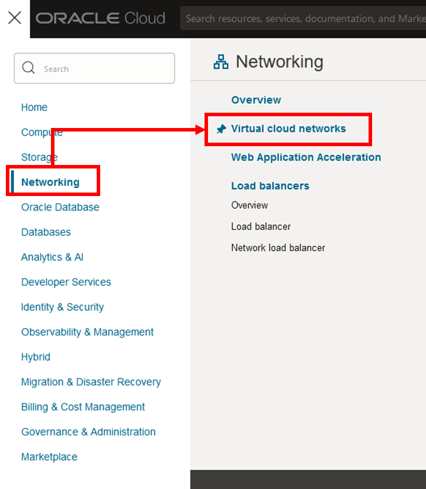

2. Seleccione el compartimiento creado en el [Laboratorio 1: Hablemos sobre los compartments](https://github.com/kapvar9/oci-FastTrack-infraestructura/tree/main/Lab1-Compartimentos#creando-un-compartment) "Compartimiento-Trial"

  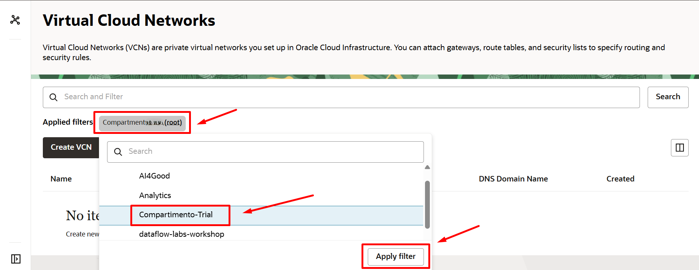
   
3. Haga clic en "Iniciar asistente de VCN"
   
    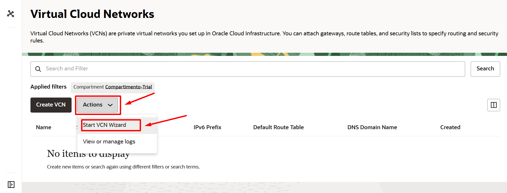

> [!NOTE]
> Usando la opción "Iniciar asistente de VCN" tendrás toda la estructura de red próxima en menos de 5 minutos.

4. Haga clic en la primera opción **"VCN con conectividad a internet"**
   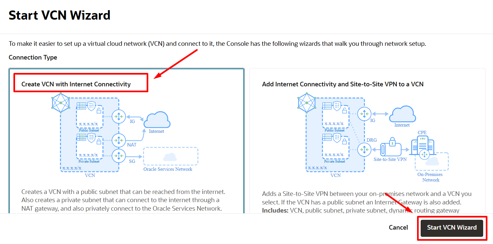

5. Configure los parámetros básicos de VCN y luego haga clic en "Siguiente"
- **Nombre:** VCN-TRIAL
- **Compartimento:** Compartimento-Trial
- **Bloque CIDR de VCN:** 10.0.0.0/16
- **Sub-red Pública:** 10.0.0.0/24
- **Sub-red Privada:** 10.0.1.0/24

   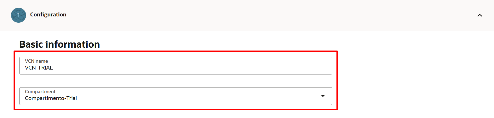
   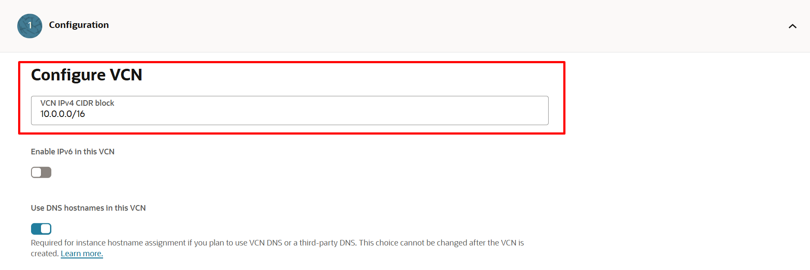
   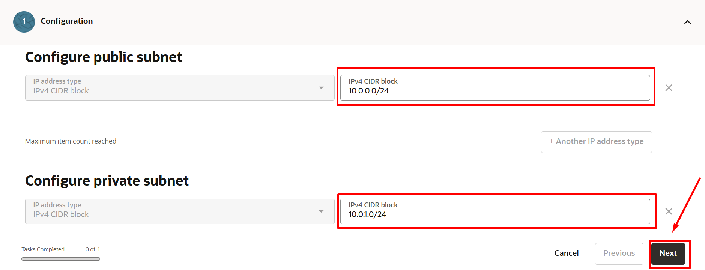

6. Revise los componentes y recursos de red que serán creados a través del wizard y haga clic en "Crear"
   
   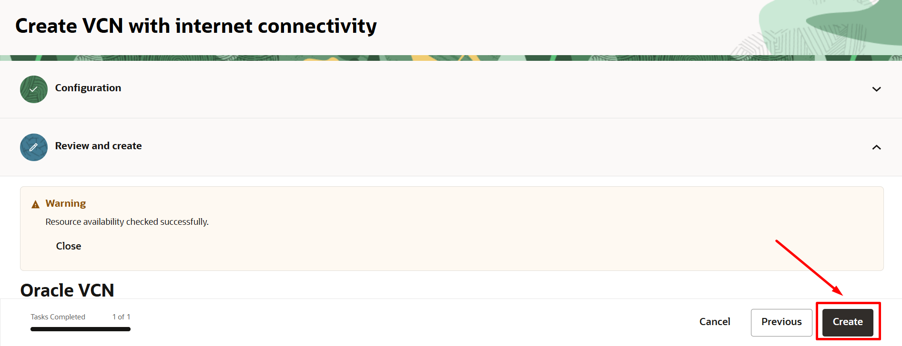
   
7. Puede revisar el estado de creación de los recursos, una vez finalizado cada uno de los procesos de creación, haga clic en "Ver VCN"

   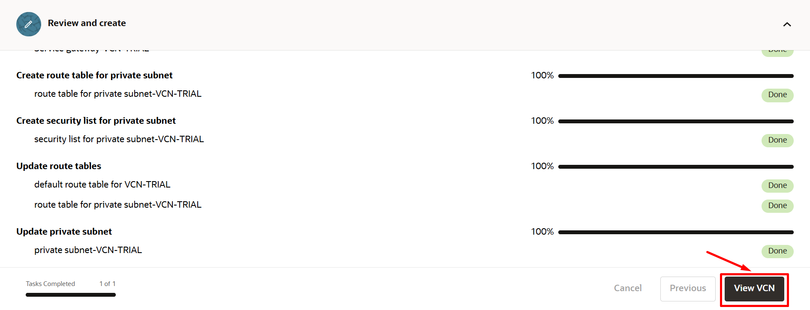

8. Una vez finalizado, se dará cuenta que la creación de la VCN fue un proceso bastante rápido y simple, gracias a asistente de creación de OCI. Ahora puede explorar los recursos creados asociados a dicha VCN

   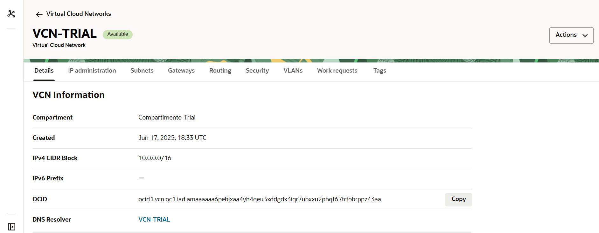

9. Regrese a la pestaña anterior para ver tambien su VCN en el panel de administración de Redes Virtuales de OCI en "Virtual Cloud Networks"

    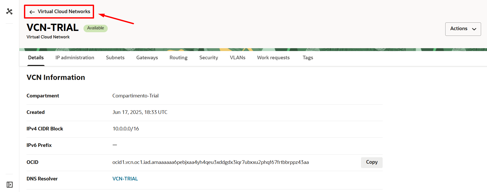

10. Acceda nuevamente a su VCN

     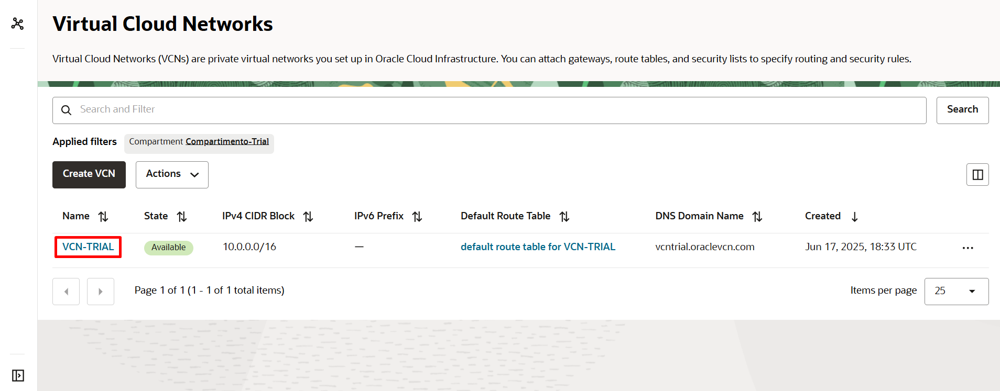

En ella podra ver que los recursos creados fueron: 1 VCN, 2 Subredes regionales (Pública y Privada), 1 Internet Gateway, 1 Nat Gateway y 1 Service Gateway y estan listos para ser utilizados en sus arquitecturas de red
    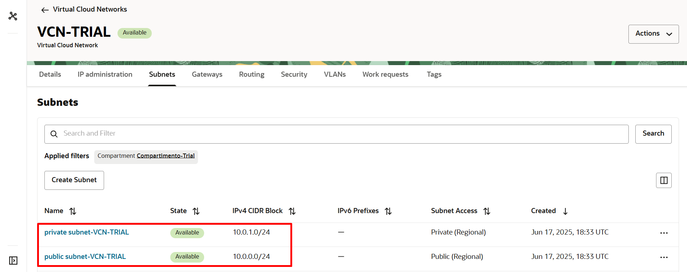
    

### Explorando una VCN ( Red Virtual en la nube)

En esta sección, aprenderás a explorar una Red Virtual en la Nube (VCN) y sus recursos.

_**Tiempo estimado para el laboratorio**_: 15 minutos

Objetivos:
- Explorar una Red Virtual en la Nube (VCN)

1. En el menú de navegación 🍔, vamos a Networking ➡️ Virtual Cloud Network

   
   
2. Seleccionamos el compartment del laboratorio, ahí encontraremos la VNC. Para recordar el nombre de su compartimiento, puede encontrar esta información en la sección **View loging info** en la parte superior derecha del livelab

       

   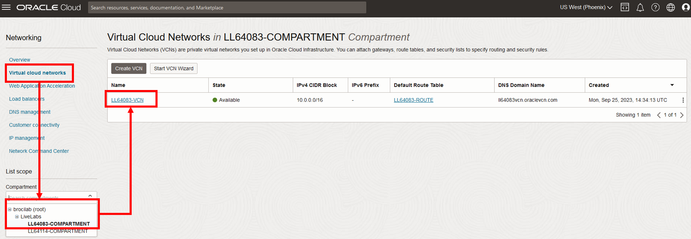
   
4. Hacemos clic en la VNC para poder explorar los recursos asociados a ella

   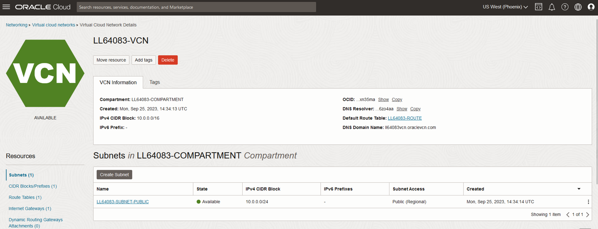

5. En la consola vera una serie de pestañas que hacen referencias a los diferentes servicios, features o recursos asociados a su VCN, puede explorarlos si asi lo desea

   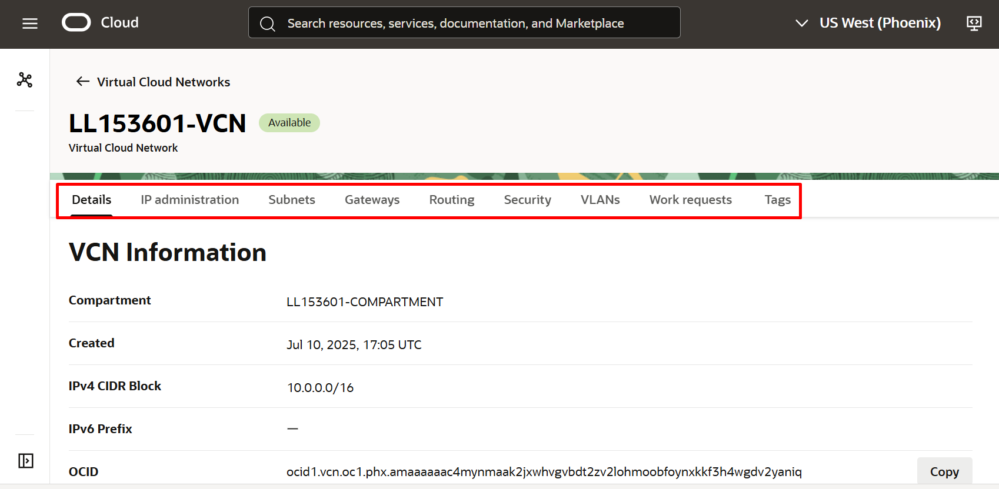

**Super! Continuemos con el siguiente laboratorio 🥳👉 [Laboratorio 3 - Máquinas Virtuales](https://github.com/kapvar9/oci-FastTrack-infraestructura/blob/main/Lab3-MaquinasVirtuales/Readme.md)**
