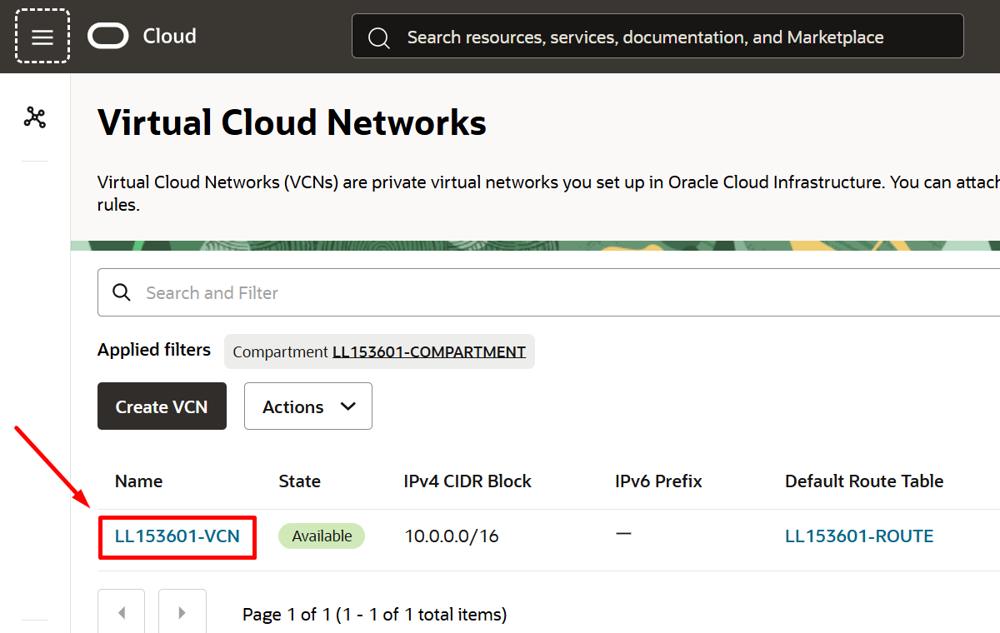

# Explorar una VCN en OCI

Esta sección contiene 2 partes:
- [VNC](#aprendamos-un-poco-sobre-lo-que-es-una-vcn)
- [Laboratorio 2](#laboratorio-2-Virtual-Cloud-Network-VCN)
  
## Aprendamos un poco sobre lo que es una VCN

Una Red de Nube Virtual o Virtual Cloud Network (VCN) es una red definida por software que configuras en los centros de datos de Oracle Cloud Infrastructure en una región específica. Se parece mucho a una red tradicional, con reglas de firewall y tipos específicos de gateways de comunicación cuya utilización puede elegir. Una VCN reside en una única región de Oracle Cloud Infrastructure y abarca uno o más bloques de CIDR (IPv4 y IPv6, si están activados). Una subred es una subdivisión de una VCN, pueden ser de tipo público o privada.

Para saber más, puedes consultar la documentación de OCI 🤓➡️ https://docs.oracle.com/es-ww/iaas/Content/Network/Concepts/overview.htm#network_landing

## Laboratorio 2: Virtual Cloud Network VCN

### Creando una VCN ( Red Virtual en la nube)

Objetivos
- Criar uma Red Virtual en la Nube (VCN)

En esta sección, aprenderás como crear una Red Virtual en la nube (VCN) y sus recursos.

1. En el menú de navegación 🍔, vamos a Networking ➡️ Virtual Cloud Network
   
    

2. Seleccione el compartimiento creado en el [Laboratorio 1: Hablemos sobre los compartments](https://github.com/kapvar9/oci-FastTrack-infraestructura/tree/main/Lab1-Compartimentos#creando-un-compartment) "Compartimiento-Trial"
   
3. Haga clic en "Iniciar asistente de VCN"
   
    

> [!NOTE]
> Usando la opción "Iniciar asistente de VCN" tendrás toda la estructura de red próxima en menos de 5 minutos.

En este laboratorio, aprenderás a explorar una Red Virtual en la Nube (VCN) y sus recursos.

_**Tiempo estimado para el laboratorio**_: 15 minutos

Objetivos:
- Explorar una Red Virtual en la Nube (VCN)

1. En el menú de navegación 🍔, vamos a Networking ➡️ Virtual Cloud Network

   
   
2. Seleccionamos el compartment del laboratorio, ahí encontraremos la VNC. Para recordar el nombre de su compartimiento, puede encontrar esta información en la sección **View loging info** en la parte superior derecha del livelab

       

   
   
4. Hacemos clic en la VNC para poder explorar los recursos asociados a ella

   

5. En la consola vera una serie de pestañas que hacen referencias a los diferentes servicios, features o recursos asociados a su VCN, puede explorarlos si asi lo desea

   

**Super! Continuemos con el siguiente laboratorio 🥳👉 [Laboratorio 3 - Máquinas Virtuales](https://github.com/kapvar9/oci-FastTrack-infraestructura/blob/main/Lab3-MaquinasVirtuales/Readme.md)**
