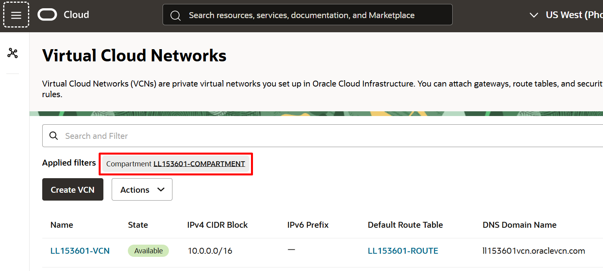

# Explorar una VCN en OCI

Esta sección contiene 2 partes:
- [VNC](#aprendamos-un-poco-sobre-lo-que-es-una-vcn)
- [Laboratorio 2](#laboratorio-2-exploremos-una-vcn)
  
## Aprendamos un poco sobre lo que es una VCN

Una Red de Nube Virtual o Virtual Cloud Network (VCN) es una red definida por software que configuras en los centros de datos de Oracle Cloud Infrastructure en una región específica. Se parece mucho a una red tradicional, con reglas de firewall y tipos específicos de gateways de comunicación cuya utilización puede elegir. Una VCN reside en una única región de Oracle Cloud Infrastructure y abarca uno o más bloques de CIDR (IPv4 y IPv6, si están activados). Una subred es una subdivisión de una VCN, pueden ser de tipo público o privada.

Para saber más, puedes consultar la documentación de OCI 🤓➡️ https://docs.oracle.com/es-ww/iaas/Content/Network/Concepts/overview.htm#network_landing

## Laboratorio 2: Exploremos una VCN

1. En el menú 🍔, vamos a Networking ➡️ Virtual Cloud Network

   
   
2. Seleccionamos el compartment del laboratorio, ahí encontraremos la VNC

   
   
3. Hacemos clic en la VNC para ver su recursos

   

**Super! Continuemos con el siguiente laboratorio 🥳👉 [Laboratorio 3](https://github.com/kapvar9/oci-FastTrack-infraestructura/blob/main/Lab3-MaquinasVirtuales/Readme.md)**
