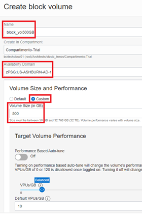
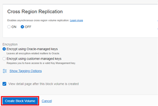
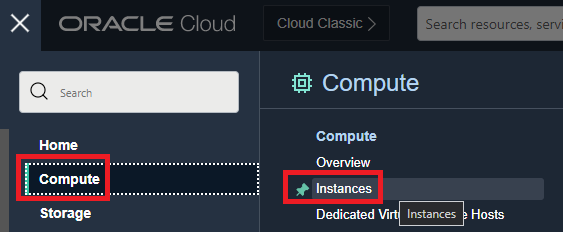
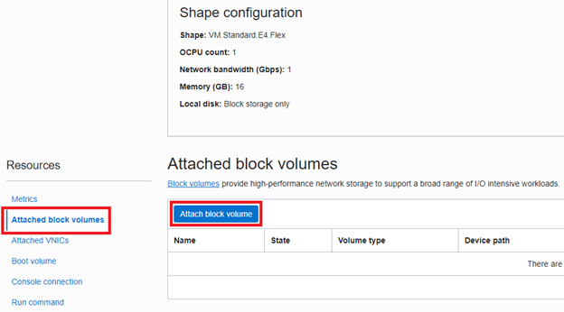
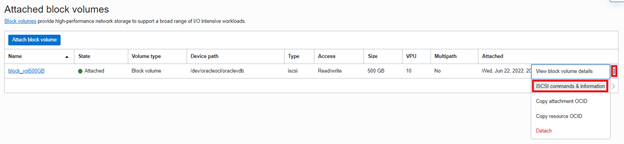
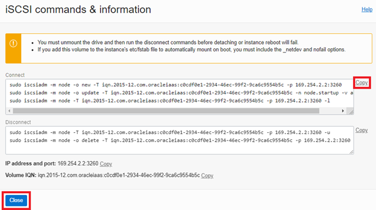
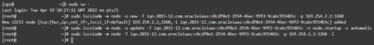
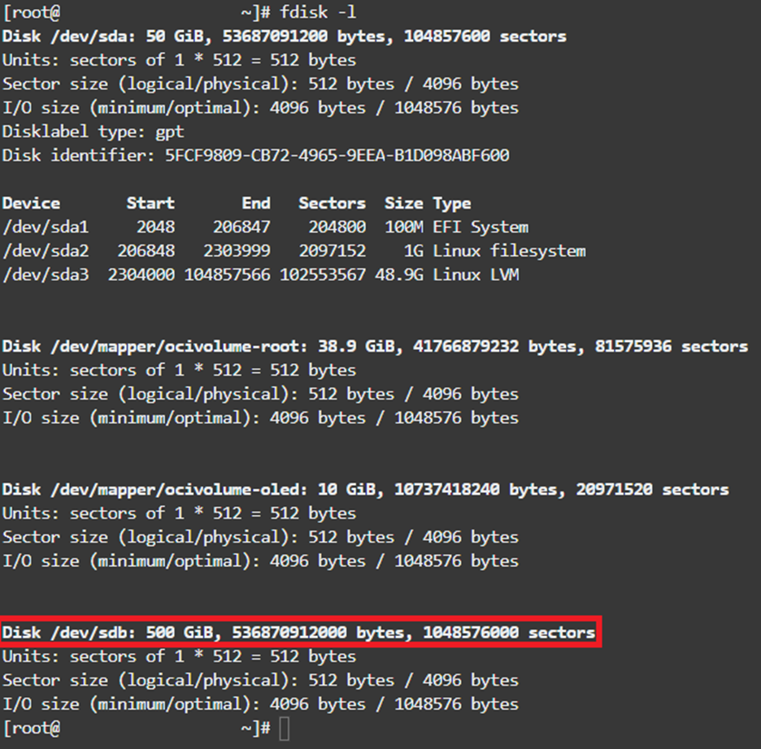
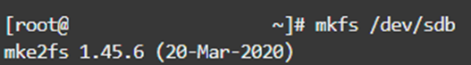
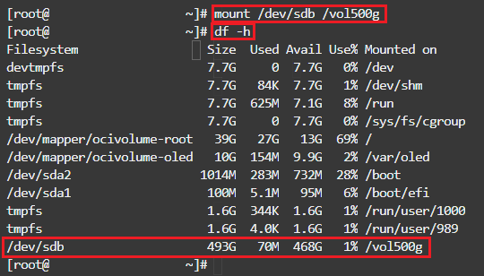

# Crear un Block Volume
## Introducción

El servicio Oracle Cloud Infrastructure Block Volume le permite aprovisionar y gestionar dinámicamente volúmenes de almacenamiento en bloques. Puede crear, adjuntar, conectar, mover volúmenes, y cambiar el rendimiento del volumen según sea necesario para cumplir con los requisitos de almacenamiento, rendimiento y aplicaciones. Después de adjuntar y conectar un volumen a una instancia, puede utilizar el volumen como un disco duro normal. También puede desconectar un volumen y adjuntarlo a otra instancia sin perder datos.

En este laboratorio aprenderá cómo trabajar con Block Storage dentro de Oracle Cloud Infrastructure.

*Tiempo estimado para este laboratorio: 20 minutos*.

### Objetivos

- Crear un Block Volume de 500GB.
- Adjuntar un Block Volume a una instancia de cómputo.


### Tarea 1: Crear un Block Volume.

1.	En el menú principal, diríjase a la sección de Storage, posteriormente de click en Block Volume.


3.	Haga click en Create Block Volume y complete la información del formulario como se muestra a continuación, para finalizar haga clic en Crear Block Volume.
a.	**Name:** block_vol500GB.
b.	**Create in compartment:** <Su-compartimiento>. 
c.	**Availability Domain:** AD1.
d.	**Size:** 500GB.
e.	**Volume Performance:** Balanced.

** *Seleccione Availability Domain (AD) para el Block Volume igual que el de la instancia de computo creada anteriormente* **

<br>


### Tarea 2: Conectar el Block Volume a una instancia de cómputo.
1.	En el menú principal, diríjase a Computo, posteriormente de clic en Virtual Instance para acceder a la instancia previamente aprovisionada.

<br>
3.	En esta sección encontrará todas las instancias de computo que ha creado, seleccione la instancia correspondiente, después desplácese hacia abajo e la página, y en el menú **“Resources”**, haga clic en **"Attached Block Volumes"**, y **"Attach block volumen"**.
<br>

<br>
5.	Complete el formulario como se muestra a continuación y haga clic en **Attach**.
a.	**Devide path:** /dev/oracleoci/oraclevdb.
b.	**Attachment type:** ISCSI.


6.	En el lado derecho, haga clic en el ícono de tres puntos y en iSCSI Commands & Information.

7. Copie el comando para 'Connect' y haga clic en **Close.**
 
8.	En Terminal, conéctese inicialmente a la instancia informática y ejecute el comando copiado.

    ```sh
    ssh opc@<ip-da-máquina>
    sudo su -
    <comando-connect>
    ```
    En este punto, estamos accediendo a la máquina, usando el usuario root y ejecutando el comando “attach”.
    

    
7.	Ejecute el siguiente comando para detectar el nuevo dispositivo 
    ```sh
    fdisk -l
    ```
    
    
### Tarea 3: Formatear el Block Volume y montar en la instancia

1. Formatee el disco com el siguiente comando
    ```sh
    mkfs /dev/sdb
    ```
 

2.	Cree un directorio que se utilizará como punto de montaje para el nuevo volumen de disco con el siguiente comando:

    ```sh
    mkdir /vol500g
    ```
  

3.	Monte el nuevo volumen del disco y verifique si el disco está disponible con los siguientes comandos:
    ```sh
    mount /dev/sdb /vol500g 
    df -h
    ```
 

Ahora usted puede seguir con el siguiente Laboratorio 

## Conclusión
En esta sesión aprendió sobre los Block Volume y como utilizarlos 

## Autoria
- **Autores** - Arthur Vianna, Lucas de Almeida, Luiz de Oliveira, Thais Henrique
- **Último Update Por/Date** - Arthur Vianna, Jun/2022
