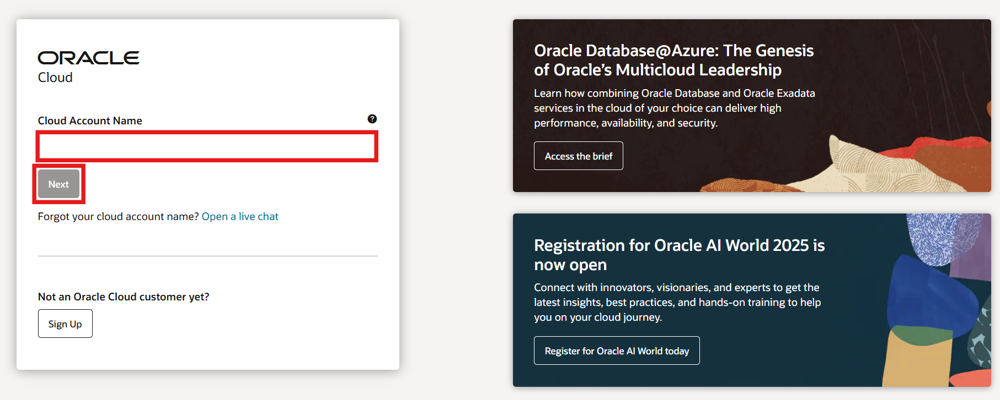
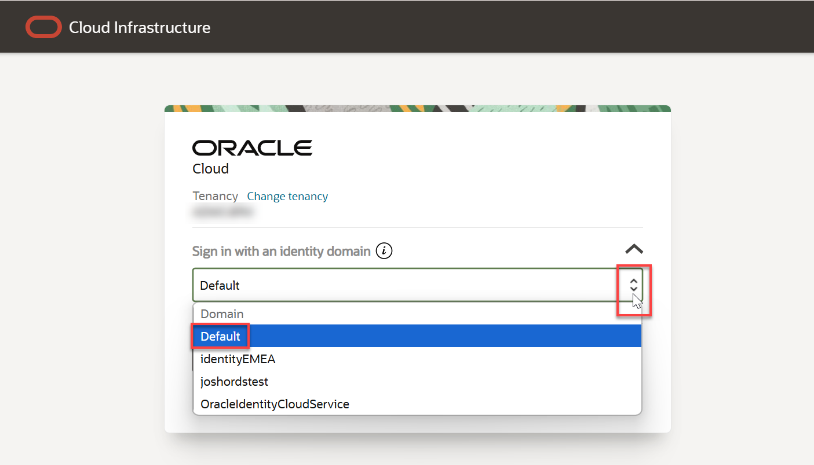
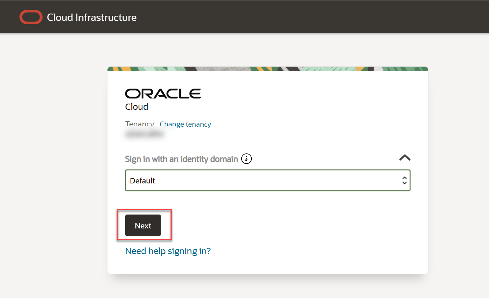
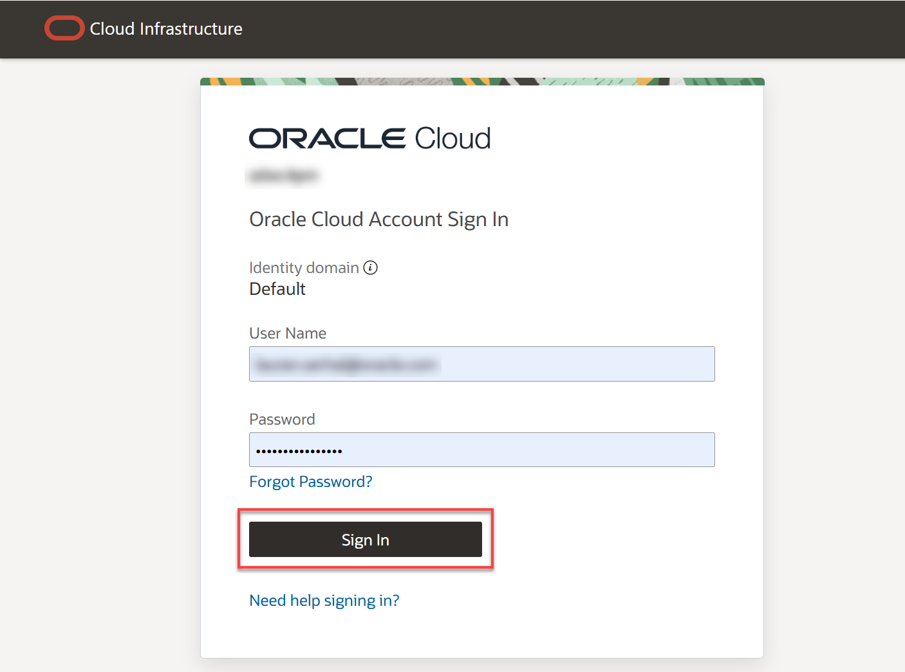
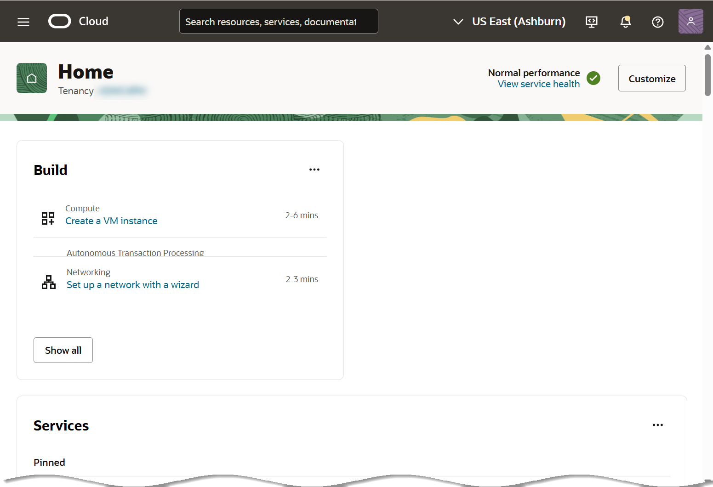

# Inicia sesión en Oracle Cloud Infrastructure (OCI)
## Introducción
Oracle Cloud es el proveedor de nube más amplio e integrado del sector, con opciones de implementación que abarcan desde la nube pública hasta su centro de datos. Oracle Cloud ofrece servicios de primera clase en Software como Servicio (SaaS), Plataforma como Servicio (PaaS) e Infraestructura como Servicio (IaaS).
## Tipos de cuentas en Oracle Cloud Infrastructure
- ***Cuentas gratuitas:*** Tras registrarse en la promoción gratuita de Oracle Cloud o en una cuenta de pago, recibirá un correo electrónico de bienvenida con los datos de su cuenta en la nube y sus credenciales de inicio de sesión.
- ***Cuentas de pago de Oracle Cloud:*** Al aprovisionar su arrendamiento, Oracle envía un correo electrónico al administrador predeterminado de su empresa con las credenciales de inicio de sesión y la URL. Este administrador puede crear un usuario para cada persona que necesite acceder a Oracle Cloud. Consulte su correo electrónico o contacte a su administrador para obtener sus credenciales y el nombre de la cuenta.

## Objetivos
- Aprender a iniciar sesión en Oracle Cloud Infrastructure
## Pre-requisitos
- Nombre de la cuenta a usar en OCI: Este es el nombre de su arrendamiento (proporcionado por el administrador o en su correo electrónico de bienvenida de Oracle Cloud)
- Nombre de Usuario
- Contraseña

## Tarea 1 - Iniciar sesión en Oracle Cloud
1. Ingrese a  [cloud.oracle.com](https://cloud.oracle.com/) e introduzca el nombre de su cuenta de OCI (nombre del arrendamiento) y haga clic en "Siguiente" . Este es el nombre que eligió al crear su cuenta. ***NO es su dirección de correo electrónico***. Si olvidó el nombre, revise el correo electrónico de confirmación.

   

2. Haga clic en la lista desplegable **Iniciar sesión con un dominio de identidad y seleccione** un Dominio de identidad como **Default/Predeterminado** y luego haga clic en **Siguiente** .

    
   
    

3. En la página de **inicio de sesión de Oracle Cloud Account** , introduzca las credenciales de su cuenta y haga clic en **"Iniciar sesión"** . Su nombre de usuario es su dirección de correo electrónico. La contraseña es la que eligió al crear la cuenta.
   
   

4. Te aparecerá una ventana de verificación segura, haz clic en _"Activar verificación segura"_. En caso de que no te aparezca dicha ventana puedes pasar al paso 8 de esta sección

   

5. Elegimos la opción de _"Aplicación móvil"_

   

6. Descargamos la aplicación móvil _"Oracle Mobile Authenticator"_ de la tienda de aplicaciones de su celular ⤵️
    - Si eres Android: https://play.google.com/store/apps/details?id=oracle.idm.mobile.authenticator&hl=en&pli=1
    - Si eres Apple: https://apps.apple.com/us/app/oracle-mobile-authenticator/id835904829

    

7. Si la cuenta ha sido agregada correctamente, te deberá aparecer este mensaje. Luego, haz clic en _"Listo"_⤵️
    
    

8. Se muestra la página de inicio de **Oracle Cloud Console** .
   
   
