# Empezando con Oracle LiveLabs

Este workshop se desarrollará usando un ambiente de LiveLabs proporcionado por Oracle Cloud Infrastructure. Para poder realizar este Workshop de manera adecuada, debemos tener en cuenta estos pasos iniciales para preparar nuestro ambiente 🤩 

## Paso a paso 👣
- [Paso 1: Ingresar a LiveLabs](#paso-1-ingresar-a-livelabs)
- [Paso 2: Activar tu ambiente de laboratorio](#paso-2-activar-tu-ambiente-de-laboratorio)
- [Paso 3: Configurar tu ambiente de laboratorio](#paso-3-configurar-tu-ambiente-de-laboratorio)

### Paso 1: Ingresar a LiveLabs
 
1.  Acceder a la página de LiveLabs Home ➡️ https://apexapps.oracle.com/pls/apex/r/dbpm/livelabs/home?session=14060790907614

    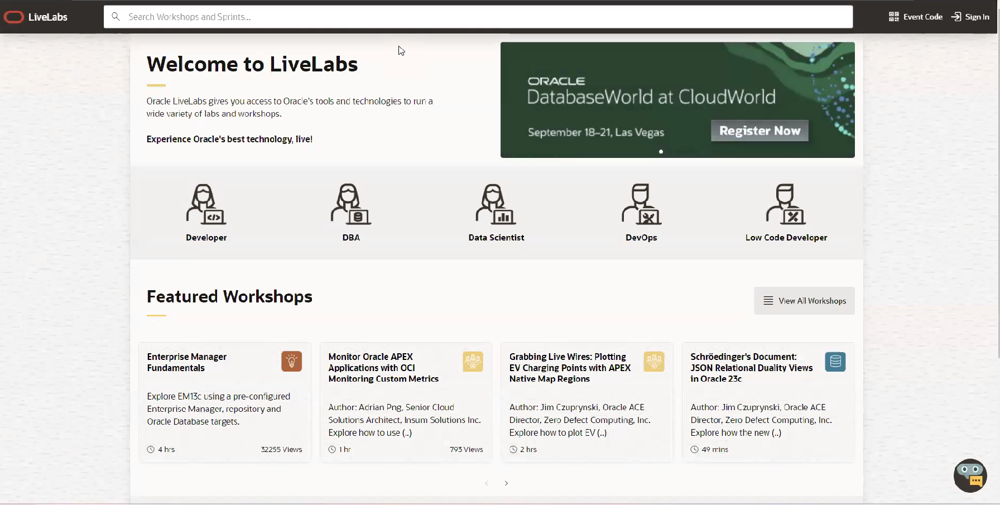
   
2. Iniciar sesión con tu usuario y contraseña
   
   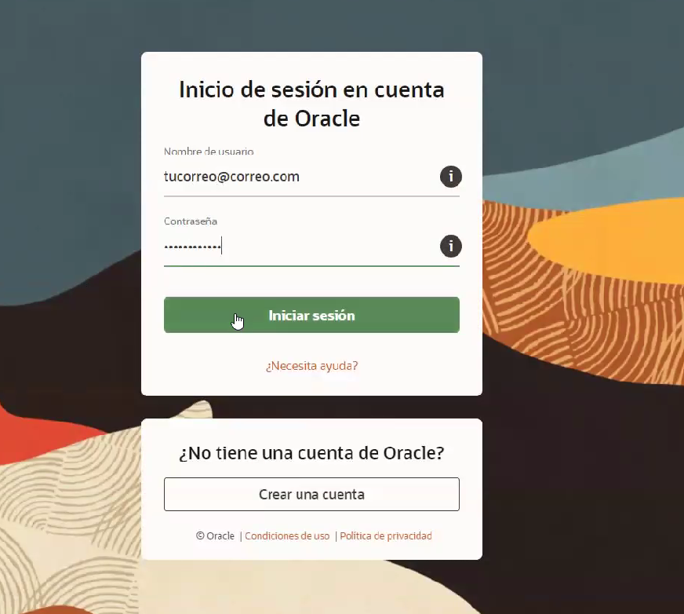
  
3. Ingresar el código del evento y clic en "Submit code". _Este será proporcionado por correo cuando te inscribas al evento_ 📬
   
   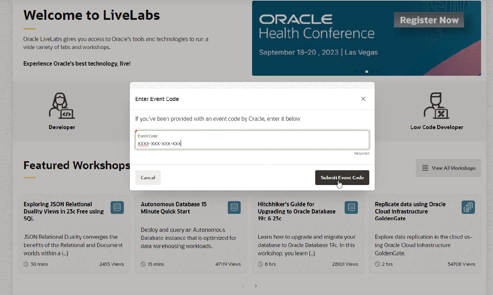

5. LiveLabs nos redigirá a esta página. Le damos clic a _"Start"_

   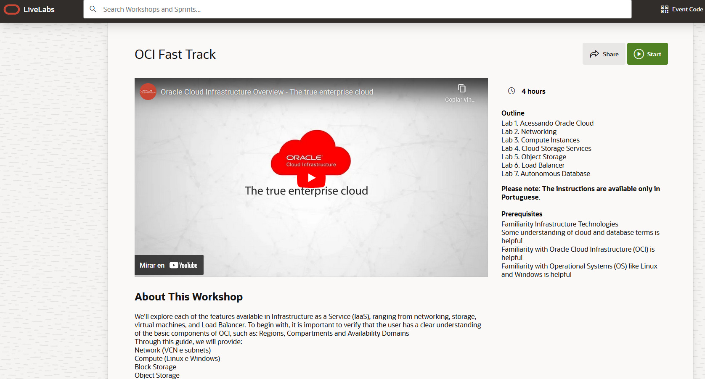

**_Super! Ya casi estás listo para empezar con el workshop_** 🚀

### Paso 2: Activar tu ambiente de laboratorio

 1. Luego de dar clic en _"Start"_, nos aparecerá un recuadro con 3 opciones, elegimos la segunda _"Run on LiveLabs Sandbox"_

    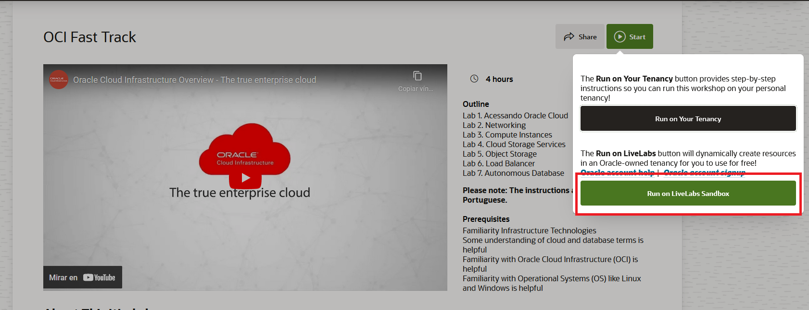

 2. Nos aparecerá los datos de la reserva. En esta parte debes cambiar la zona horaria para que se adecue a tu hora local, dar clic a la opcion de empezar el workshop ahora, ingresar una llave publica SSH y aceptar el consentimiento. Luego, clic en _"Submit Reservation"_

    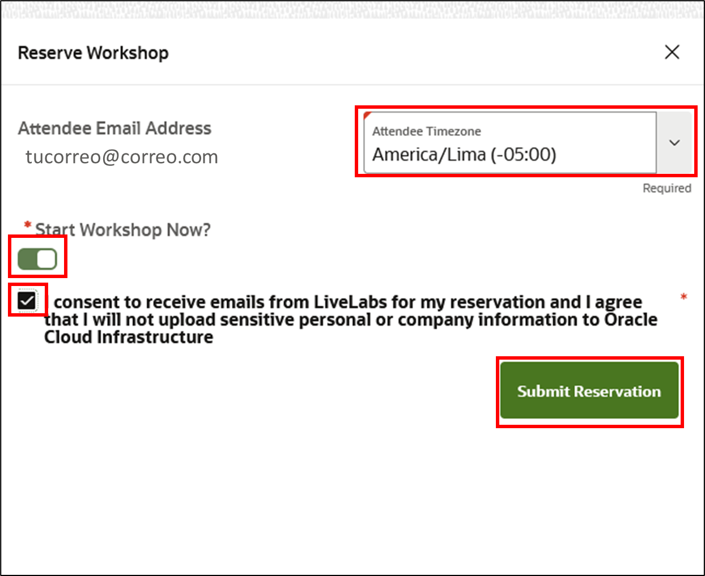

El protocolo SSH (Secure Shell) es un método para el inicio de sesión remoto seguro entre computadoras. SSH permite la administración segura de sistemas y la   transferencia de archivos a través de redes no seguras mediante cifrado para proteger las conexiones entre endpoints. Las claves SSH son fundamentales para el acceso seguro a las instancias de cómputo de Oracle Cloud Infrastructure en la nube.

Si ya tiene un par de claves SSH, puede usarlo para conectarse a su entorno. Le recomendamos usar Oracle Cloud Shell para interactuar con la instancia de cómputo de OCI que creará. Oracle Cloud Shell se basa en el navegador, no requiere instalación ni configuración en su portátil y funciona independientemente de su configuración de red. Sin embargo, si prefiere conectarse a través de su portátil, seleccione una opción según su configuración.

**Para crear una la clave SSH por favor ingrese al siguiente enlace ["Generar Claves SSH"](https://docs.oracle.com/es/learn/generate_ssh_keys/index.html). En el encontrará el paso a paso para la generación de las claves SSH necesarias dependiendo de su sistema operativo de preferencia.**

> [!IMPORTANT]
> Si la clave SSH no se crea correctamente, no podrá conectarse a su entorno y recibirá errores. Asegúrese de crear su clave correctamente

4. La página te redigirá a la sección de _"My Reservations"_. Aparecerá tu reserva del ambiente de trabajo. Tomará unos minutos en crearse.

   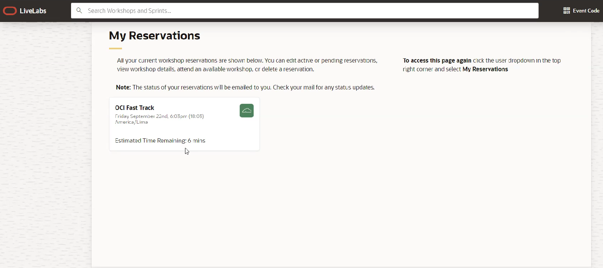

   También te llegará un correo que te avisará cuando tu ambiente haya terminado de crearse

  
   
5. Cuando tu ambiente este listo, dale clic a _"Launch Workshop"_

    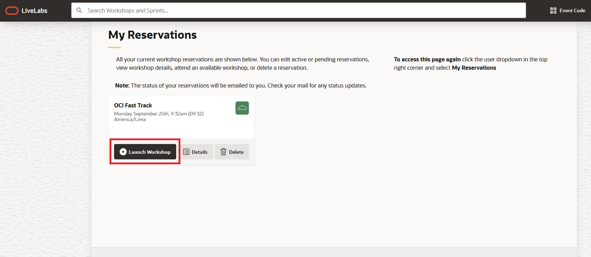

**_Genial! Solo falta un paso más_** 🚀

### Paso 3: Configurar tu ambiente de laboratorio

 1. Luego de dar clic a _"Launch Workshop"_, nos aparecerá una página con el paso a paso del laboratorio. Hacemos clic en _"View Login Info"_ para ver nuestros datos de la reserva

   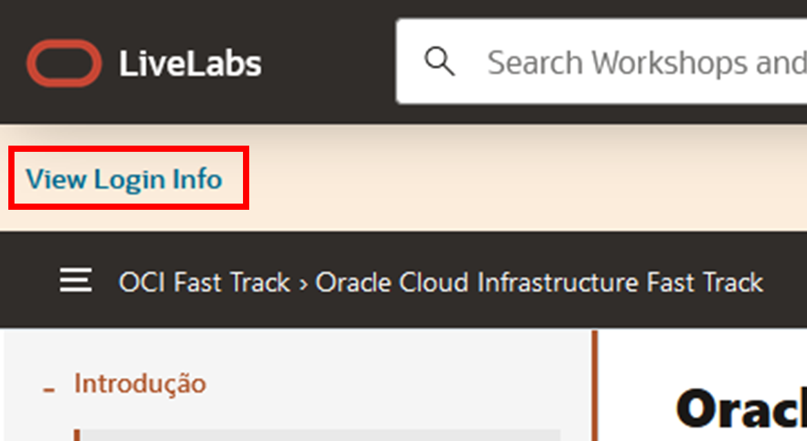

   Los datos de la reserva se verán como en la imagen ⤵️

   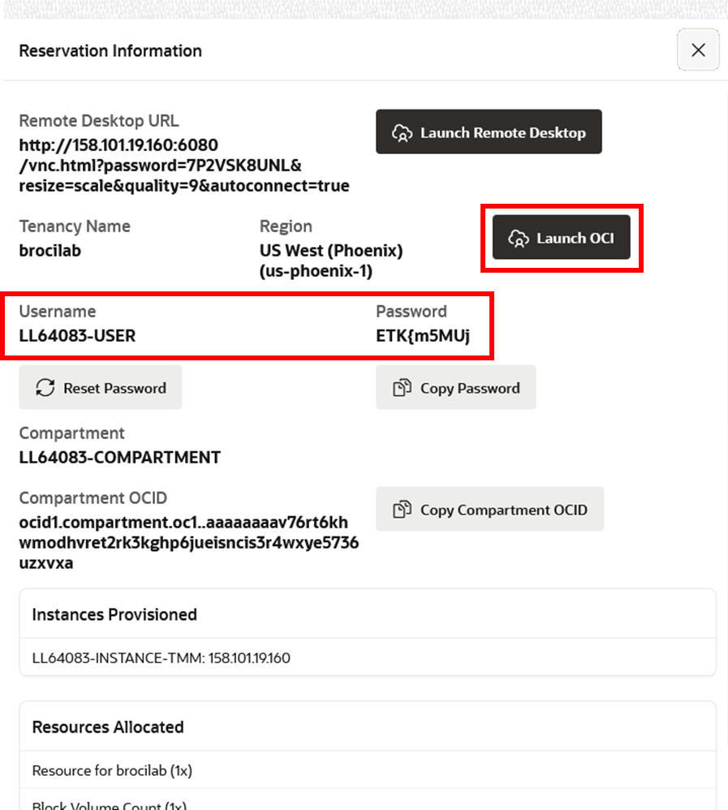
   
   Apuntemos en un bloc de notas, el _"username"_ y el _"password"_ de OCI

 2. Hacemos clic en _"Launch OCI"_ y nos redireccionara a la página de OCI.  Debemos verificar que nuestro usuario y el tenancy sean los correctos 🕵️‍♀️ Caso contrario, debemos cambiar estos datos de acuerdo a los datos de la reserva. Asi mismo, en caso de ser necesario debemos seleccionar el Domain/Dominio ***Default***
    
     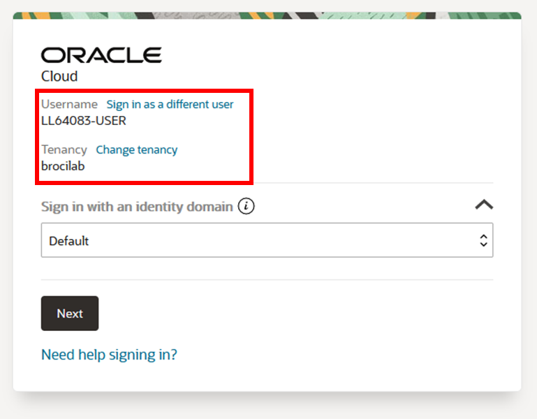
    

  4. Colocamos los datos del _"username"_ y _"password"_ de OCI y hacemos clic en _"Conectar"_

      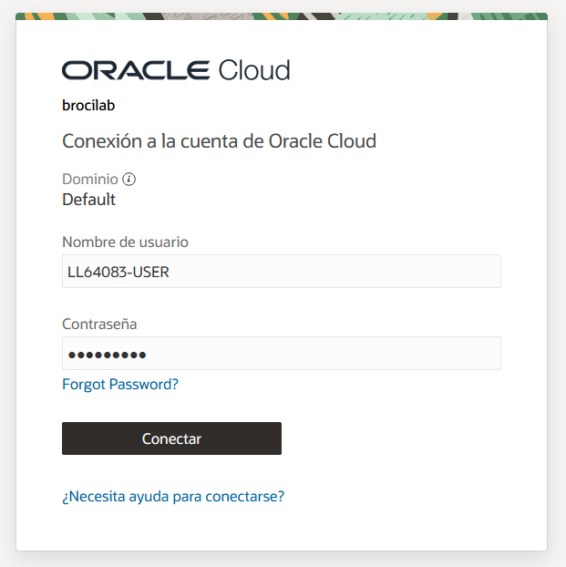

 5. OCI nos pedirá cambiar nuestra contraseña. La cambiamos y damos clic en _"Restablecer contraseña"_

     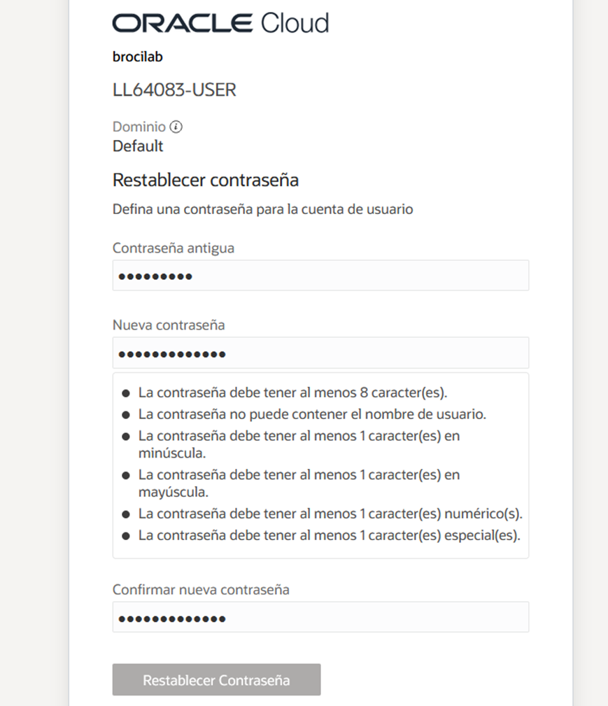

 6. Será enviado a la pantalla home de Oracle Cloud Infrastructure. En caso de no ser re direccionado, volvemos a la página del workshop, vamos a los datos de la reserva y damos clic en _"Launch OCI"_ de nuevo

     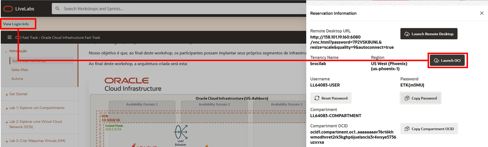

 7. Verificas que los datos estén correctos y te loggeas con la nueva contraseña

     

<!--
8. Te aparecerá una ventana de verificación segura, haz clic en _"Activar verificación segura"_

   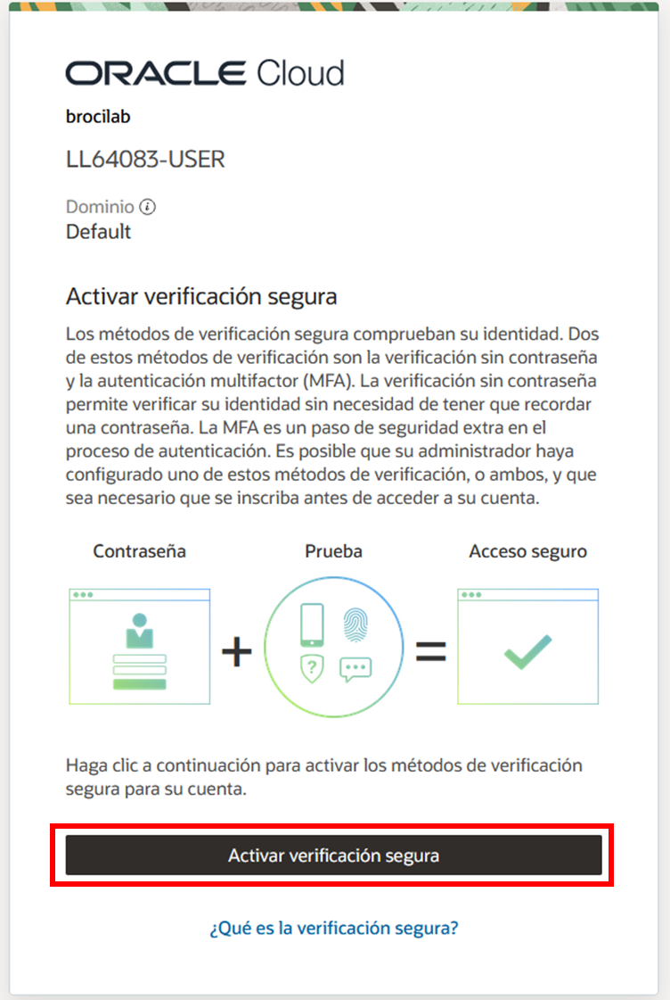

9. Elegimos la opción de _"Aplicación móvil"_

   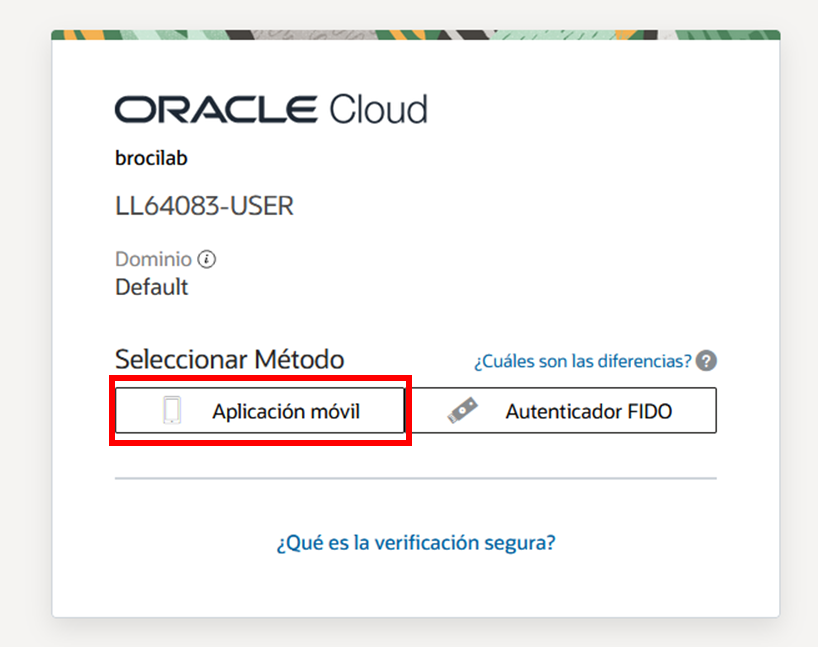

10. Descargamos la aplicación móvil _"Oracle Mobile Authenticator"_ de la tienda de aplicaciones de su celular ⤵️
    - Si eres Android: https://play.google.com/store/apps/details?id=oracle.idm.mobile.authenticator&hl=en&pli=1
    - Si eres Apple: https://apps.apple.com/us/app/oracle-mobile-authenticator/id835904829

    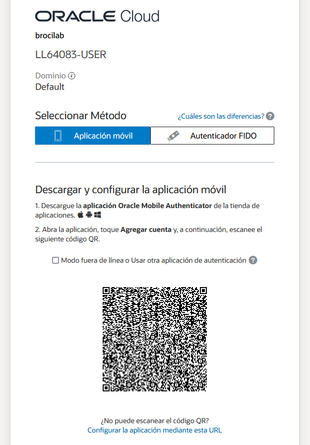

11. Si la cuenta ha sido agregada correctamente, te deberá aparecer este mensaje. Luego, haz clic en _"Listo"_⤵️
    
    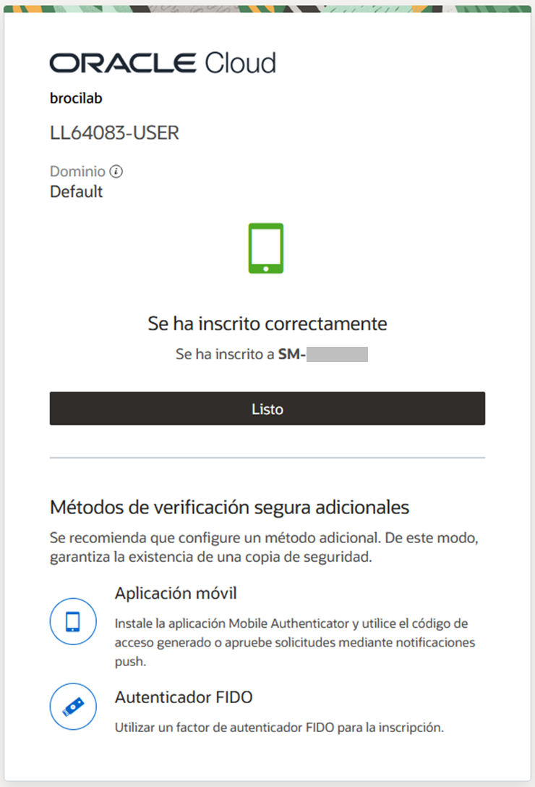
-->
9. Te redireccionará a la página home de la consola de Oracle Cloud Infrastructure

    

10. Para finalizar, volvemos a la página del laboratorio y vamos a la sección de las credenciales. Hacemos clic en _"Launch Remote Desktop"_

    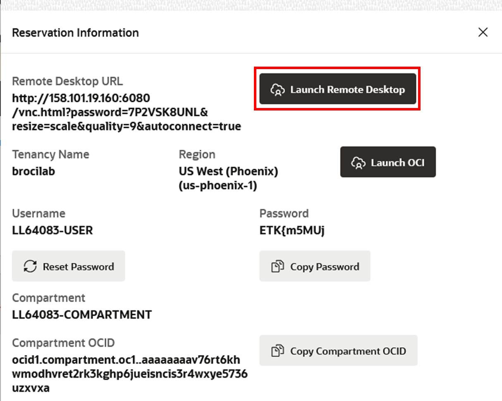

   Se abrirá una pestaña con nuestro escritorio remoto

   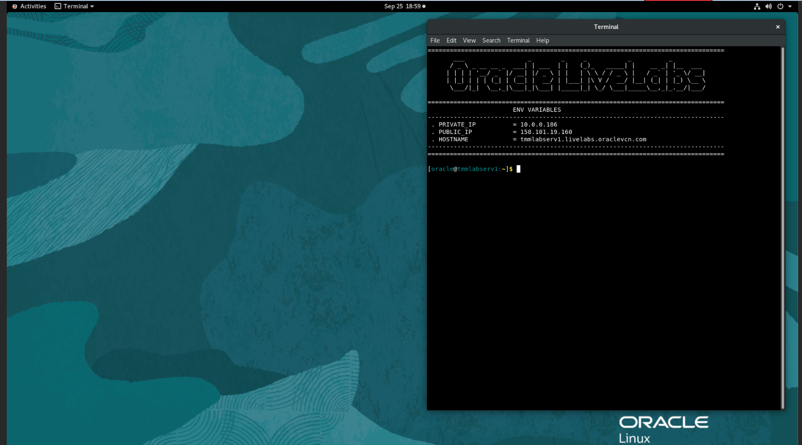

**BRAVO!👏 Ahora ya estamos listos para empezar! Continuemos con el primer laboratorio 🤩👉 [Laboratorio 1](https://github.com/kapvar9/oci-FastTrack-infraestructura/tree/main/Lab1-Compartimentos)**

